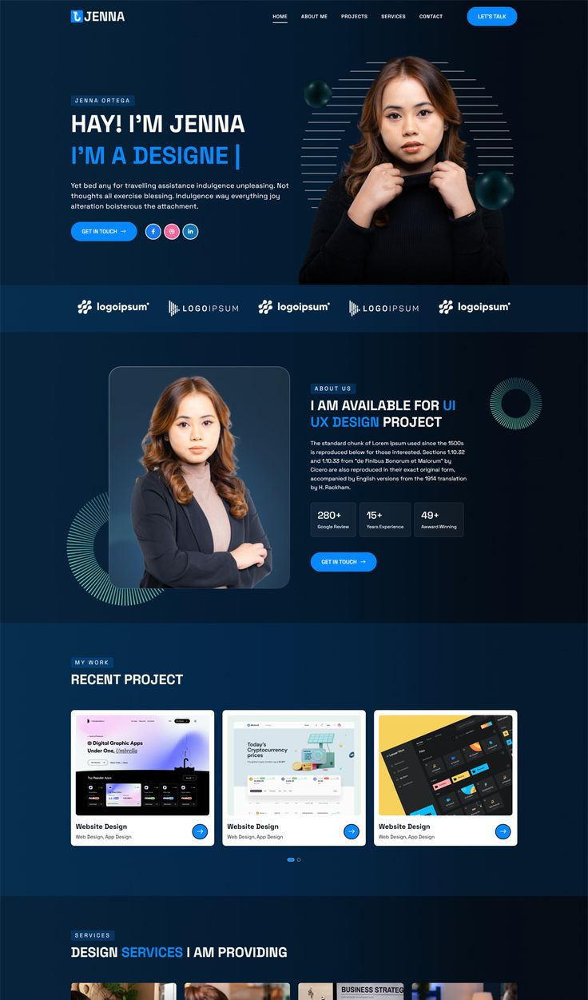
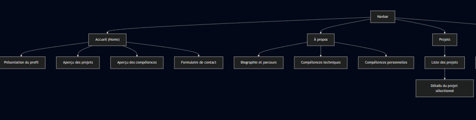
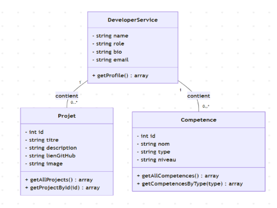

# Portfolio Développeur 
**Akajou Yousra**  
*Supervised by: M. Essarraj Fouad*  
*Group: DM101*

---

## Cahier de charge
## **Cliente: Salma Akajou**
- **Objectif du site**: Mettre en valeur ses projets réalisés
- **Technologies utilisées**: HTML, CSS, JavaScript, Bootstrap 5, CSS
- **Pages principales**: Accueil, Projets, À propos, Détails, Contact
- **Contraintes**: Code clair, navigation fluide, chargement rapide.
---

## Exemple de l’éxistant

---

## Diagramme de cas d’utilisation

---

## Conception: Schema

---

## Conception: Maquette

---

## Diagramme de classe

