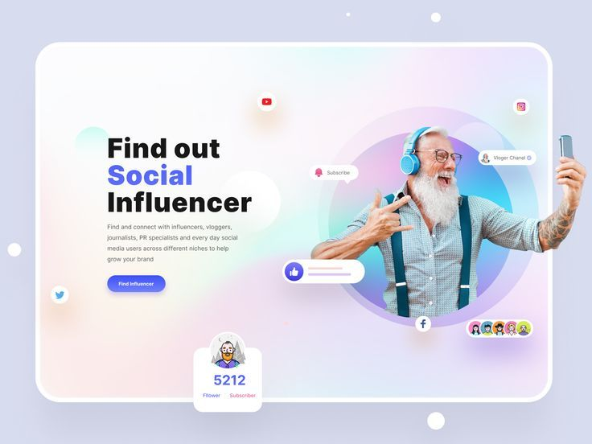
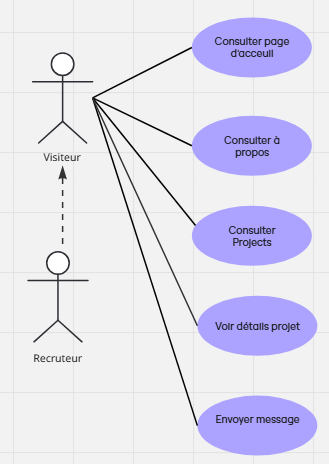
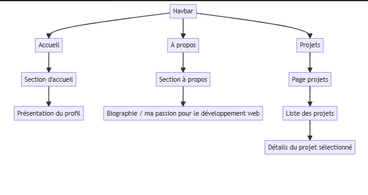
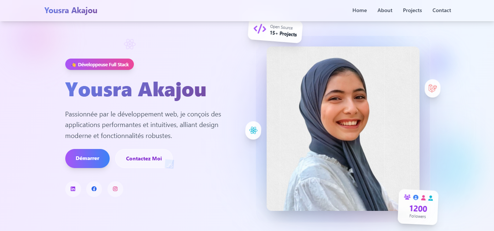
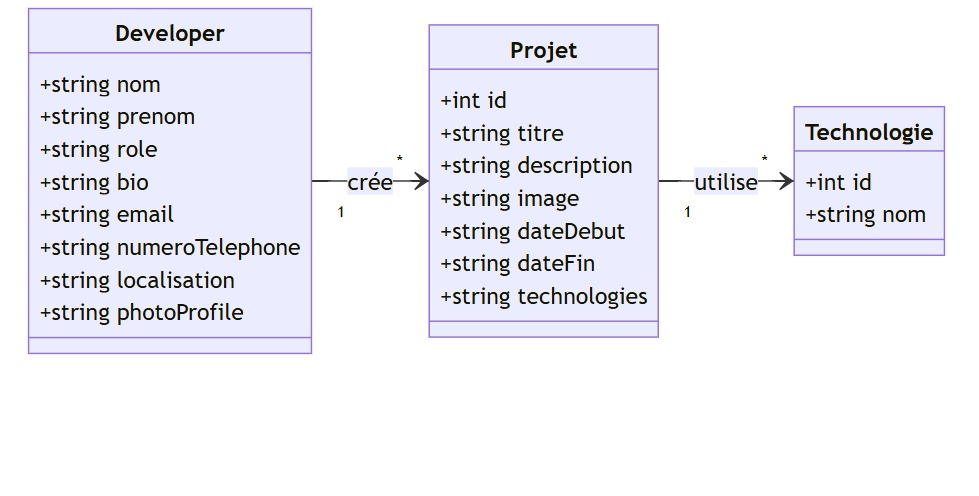

# Portfolio Développeur 
**Akajou Yousra**  
*Supervised by: M. Essarraj Fouad*  
*Group: DM101*

---

## Cahier de charge
## **Cliente: Salma Akajou**
- **Objectif du site**: Mettre en valeur ses projets réalisés
- **Technologies utilisées**: HTML, CSS, JavaScript, Bootstrap 5, CSS
- **Pages principales**: Accueil, Projets, À propos, Détails, Contact
- **Contraintes**: Code clair, navigation fluide, chargement rapide.
---

## Exemple de l’éxistant

---

## Diagramme de cas d’utilisation

---

## Conception: Schema

---

## Conception: Maquette

---

## Prompt

Create a modern, animated personal portfolio website using HTML, Tailwind CSS, and JavaScript.

The portfolio should have a clean, professional, and creative design, suitable for a web developer or designer.

Structure of the website:

Home Page:

Full-screen hero section with a background image or gradient.

A short welcoming message (e.g., “Hi, I’m Yousra Akajou — Web Developer”).

A smooth scroll-down arrow animation.

About Section:

A rounded profile photo.

A short paragraph describing who I am, my skills, and my passions.

A few animated skill bars or progress circles (HTML, CSS, JavaScript, React, etc.).

Projects Section:

Grid layout with animated hover effects.

Each project card includes a title, short description, and “View Details” button.

When clicking a project, it opens a dedicated Project Details page with:

Project name, screenshots, description, technologies used, and a link (demo or GitHub).

Contact Section:

A simple and elegant contact form (name, email, message).

A button with hover animation.

Social media icons (GitHub, LinkedIn, Instagram) with color hover effects.

Navbar:

Fixed at the top with smooth scroll behavior.

Includes links: Home | About | Projects | Contact.

Design style:

Use modern fonts (like Poppins or Inter).

Apply soft pastel or gradient colors (e.g., purple, pink, blue).

Include subtle animations (fade-ins, slide-ups, hover effects).

Make it responsive (mobile, tablet, desktop).

Optional extras:

Add a “Back to top” button.

Include light/dark mode toggle.

Add small animations with AOS.js or Framer Motion style transitions.

The goal is a modern, elegant, and smooth portfolio that looks good at 100% zoom without being too zoomed in.

---

## Diagramme de classe

